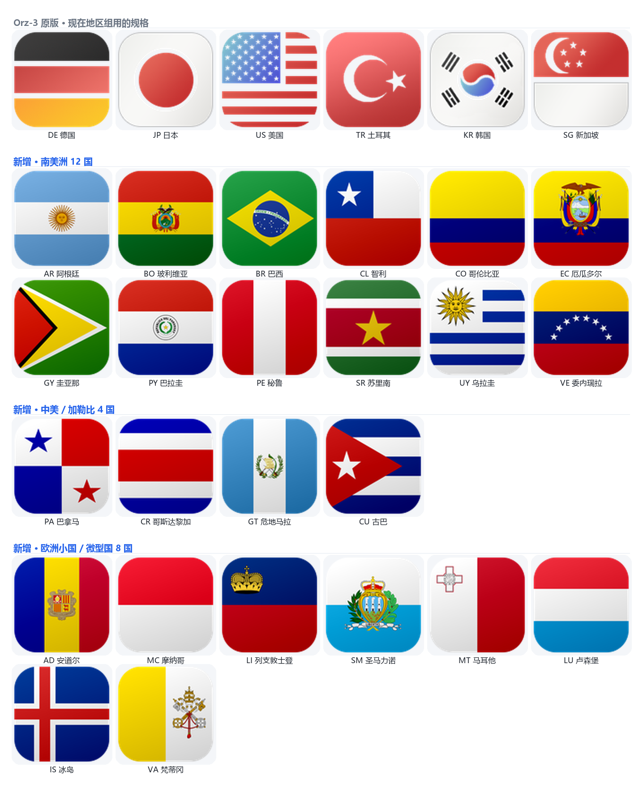
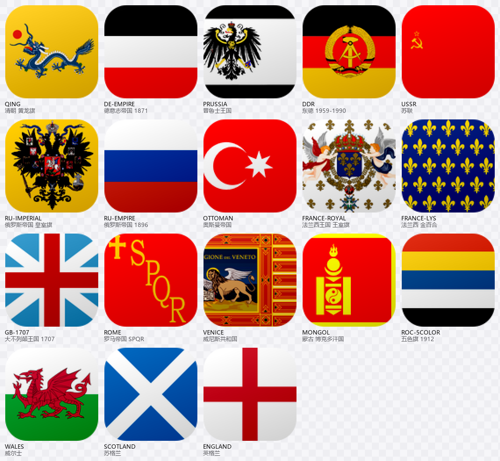
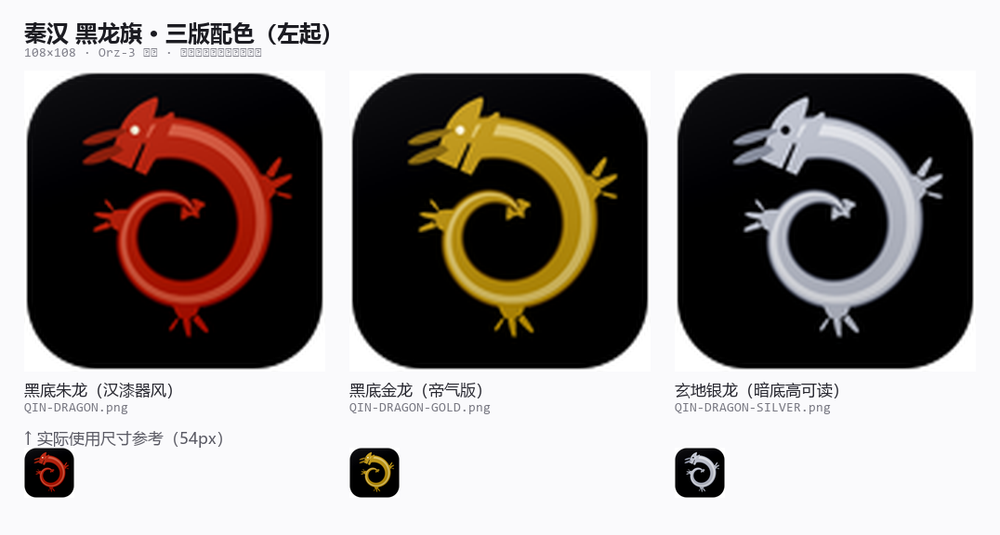

# ss_qx_plan

个人自用的 Quantumult X 分流配置 —— 基于「墨鱼自用QX配置 2.0」做了一轮针对性定制。

> ⚠️ 本仓库是**个人自用版本**，不是墨鱼官方发布，也**未获原作者授权**。
> 想要原版请去：<https://ddgksf2013.top/Profile/QuantumultX.conf>

---

## 仓库内容

| 路径 | 说明 |
| --- | --- |
| `QuantumultX.conf` | 主配置，可直接导入 Quantumult X |
| `docs/` | 5 份中文文档：使用说明 / 规则总清单 / 导入后验证清单 / 体检与优化方案 / 去广告清单与卡顿排查 |
| `rules/` | **可直接引用的独立规则集**（见下方「可以单独引用的规则集」一节）——不装整份配置也能用 |
| `icons/` | 自绘图标：节点图标（方版）+ **国家图标补充包 24 国** + **历史旗帜图标包 21 面**（见下方两节） |

## 来源与致谢

本配置基于 [@ddgksf2013](https://github.com/ddgksf2013)（墨鱼手记）的
**「墨鱼自用QX配置 2.0」** 修改而成：

- 原配置：<https://ddgksf2013.top/Profile/QuantumultX.conf>
- TG 频道：[@ddgksf2021](https://t.me/ddgksf2021)

配置文件头部**完整保留了原作者的署名块与 changelog** —— 这是刻意保留的，请连同本段一起保留。

配置中另外引用了以下作者的成果：

- **图标**：[Orz-3](https://github.com/Orz-3/mini)、[Koolson](https://github.com/Koolson/Qure)
- **分流规则**：[blackmatrix7](https://github.com/blackmatrix7/ios_rule_script)、[ConnersHua](https://github.com/ConnersHua/RuleGo)、[Cats-Team](https://github.com/Cats-Team/AdRules)、[VirgilClyne](https://github.com/VirgilClyne)
- **脚本 / 重写**：[chavyleung](https://github.com/chavyleung/scripts)、[KOP-XIAO](https://github.com/KOP-XIAO/QuantumultX)

**原配置及上述各项资源，版权归各自作者所有。本仓库仅为个人自用定制版，禁止任何商业用途。**

## 相对原版改了什么

| # | 主题 | 改动 |
| --- | --- | --- |
| 1 | 精简 | 远程规则集 19 → 14 套；重写 18 → 10 条；删掉 4 个已无人引用的空策略组 |
| 2 | 兜底改直连 | `final, direct` —— 国内流量天然直连，不再依赖 `geoip, cn` 判断 |
| 3 | 本地直连白名单 | 加密货币交易所（Binance / OKX / Bybit / Bitget 及自带钱包）、国产 AI（豆包 / DeepSeek / Kimi / 智谱 / 通义 等）、常见国内服务 |
| 4 | Soul 改属地 | 单独策略组 + 走代理，让 Soul 显示海外 IP |
| 5 | 地区测速组 | 在原有港台日新美基础上，新增 **韩国 / 英国 / 大马 / 德国 / 火鸡（土耳其）** |
| 6 | 图标统一 | 大马节点图标重绘为方版，与 Orz-3 那套同规格（见 `icons/`） |
| 7 | 修一个卡顿 | 远程规则里 `opt.doubao.com` 被 reject 导致豆包启动变慢，用本地白名单盖掉 |
| 8 | 国产 AI / 输入法 / 语音引擎直连 | 共 58 行白名单：字节系与国产 AI（含 Kimi / 智谱 / 百川 / 秘塔 / 天工 等）、搜狗 / 讯飞 / 百度 / 手心 / QQ 输入法、讯飞与百度的语音识别 API、思必驰 / 云知声 / 捷通华声 —— 防止去广告规则**每日更新**时误伤「输入法语音」这类功能域 |
| 9 | 国家图标补充包 | 补齐 Orz-3 图标库里缺失的 **24 个国家/地区**方版图标（南美 12 + 中美加勒比 4 + 欧洲小国 8），见 `icons/flags/` |
| 10 | 历史旗帜图标包 | **18 面**已退场的历史旗帜（清朝黄龙旗 / 德意志帝国 / 普鲁士 / 东德 / 苏联 / 沙俄 / 奥斯曼 / 法兰西王国 / 大不列颠 1707 / 罗马 / 威尼斯 / 蒙古博克多汗国 / 五色旗）+ 威尔士 / 苏格兰 / 英格兰，见 `icons/historical/` |
| 11 | 秦汉黑龙旗（自绘） | 按史实配色**程序生成**的秦蟠龙旗 **3 版**（黑底朱龙 / 金龙 / 银龙），无第三方素材、无授权限制，见 `icons/historical/` |

完整逐条记录写在 `QuantumultX.conf` 文件头的「共 19 处改动」里。

## 怎么用

### 方式一 · 订阅导入（推荐）

1. 打开 Quantumult X → 「设置」→ 「配置文件」→ 「导入」
2. 粘贴下面的地址：

```
https://raw.githubusercontent.com/peqw0312/ss_qx_plan/main/QuantumultX.conf
```

> 国内网络直连 `raw.githubusercontent.com` 可能失败，可加加速前缀：
> `https://ghproxy.net/https://raw.githubusercontent.com/peqw0312/ss_qx_plan/main/QuantumultX.conf`

### 方式二 · 手动复制

把 `QuantumultX.conf` 内容整体复制，粘贴进 Quantumult X 的配置文件编辑器。

## 可以单独引用的规则集

`rules/domestic-direct.list` 是从本配置里抽出来的**独立直连白名单**，与主配置内容同源。
**你不需要整份配置，也能单独用它。**

它解决的问题很具体：

> 国产输入法（搜狗 / 讯飞 / 百度 / 手心 / QQ）和国产 AI 的语音识别，都要连国内服务器。
> 而各家去广告规则集里夹着一批 `*.sogou.com` 之类的 **reject** 规则，而且**每天更新** ——
> 平时拦的是广告和埋点，一旦误伤到功能域，表现就是「**语音输入没反应**」，
> 排查起来你根本想不到是代理配置干的。

用法（Quantumult X）：

```ini
[filter_remote]
https://raw.githubusercontent.com/peqw0312/ss_qx_plan/main/rules/domestic-direct.list, tag=国产直连, force-policy=direct, update-interval=604800, enabled=true
```

**两个必须注意的点：**

1. ⚠️ **这条要排在去广告规则集之前。**
   QX 的匹配顺序是「本地规则 → 远程规则（按书写顺序）→ `final`」，谁先命中谁生效。
   排在广告规则后面 = 等于没写。
2. ✅ **更稳的做法**：把文件里 `host-suffix` 那些行整段拷进 `[filter_local]`
   （本地规则永远优先），并确保写在 `geoip, cn, direct` 之前。

**已知取舍**（规则集文件头部也写了一遍）：

- 搜狗只钉**精确功能域**，没有宽匹配 `sogou.com` —— 否则会连带放行 26 条搜狗广告 / 统计 / 导航域
- 百度只钉**输入法本体**，没有宽匹配 `baidu.com` —— 否则 `mobads.baidu.com` 那条开屏去广告会失效
- 生效后会放行约 7 条**埋点 / 统计型**的 reject 规则。这是刻意的：埋点不值得让功能域冒被误伤的风险

规则集内容为实测所得（逐个 DNS 解析 + 核对去广告规则集的实际拦截项），
**可自由取用、修改、再分发，无需署名**。

## 国家图标补充包（24 国）

`icons/flags/` 里是 **24 个方版国家/地区图标**（108×108 PNG），用来补齐
[Orz-3/mini](https://github.com/Orz-3/mini) 图标库里缺失的国家 ——
它那 336 个图标里，国家/地区类只有 17 个，**南美 / 中美 / 加勒比 / 欧洲小国基本空白**，
想给「巴西节点」配个同风格的图标都找不到。

覆盖范围：**南美 12 国 + 中美与加勒比 4 国 + 欧洲小国 8 国**，
规格、光泽、外轮廓都和 Orz-3 同源（风格对比见预览图第一行）。



用法：

```ini
static=巴西节点, img-url=https://raw.githubusercontent.com/peqw0312/ss_qx_plan/main/icons/flags/BR.png, 节点1, 节点2
```

⚠️ Quantumult X 的 `img-url=` **只接受公网地址**，不能填本地路径 —— 所以这批图标挂在
GitHub 上正好能用。完整清单、规格与许可说明见
[`icons/flags/README.md`](icons/flags/README.md)。

## 历史旗帜图标包（21 面）

`icons/historical/` 收的是**已经退出历史舞台的旗帜**：清朝黄龙旗、德意志帝国、普鲁士、
东德、苏联、沙俄、奥斯曼、法兰西王国、大不列颠 1707 旧米字、罗马 SPQR、威尼斯共和国、
蒙古博克多汗国、五色旗，外加威尔士 / 苏格兰 / 英格兰三面子国族旗，
以及一面**自绘的秦汉黑龙旗**（3 版配色）。
规格、光泽、外轮廓与上面那套完全一致。



```ini
static=大清节点, img-url=https://raw.githubusercontent.com/peqw0312/ss_qx_plan/main/icons/historical/QING.png, 节点1
```

### 秦汉 黑龙旗（自绘 · 3 版配色）



秦汉没有传世旗帜实物，也没有可用的现成矢量素材，这面是**按史实配色程序生成**的：
秦旗为黑底（《史记》「衣服旄旌节旗皆上黑」），「黑龙」出自秦文公获黑龙的水德祥瑞，
配色取秦汉漆器通行的**黑地朱纹**，纹样用战国秦汉的**蟠龙**而非明清五爪金龙。

| 文件 | 配色 |
| --- | --- |
| `QIN-DRAGON.png` | 黑底**朱龙**（汉漆器风，最贴史实） |
| `QIN-DRAGON-GOLD.png` | 黑底**金龙**（帝气版） |
| `QIN-DRAGON-SILVER.png` | 黑底**银龙**（暗色图标栏最醒目） |

纯几何程序生成，不是描图也不是素材拼贴，**可自由使用，无授权限制**。

⚠️ **这批的授权状态和上面那套不一样**：其中 13 面的底图来自
[FOTW（Flags of the World）](https://www.fotw.info/)，它的条款要求「不得以任何方式修改原图」，
而做成图标必然要裁切、缩放、加光泽 —— 所以 `icons/historical/` **明确限定为个人自用素材**，
不做商用、不主张任何权利。余下 8 面（五色旗 / 帝俄三色旗 / 秦汉黑龙旗 3 版为程序自绘，
威尔士 / 苏格兰 / 英格兰来自 MIT 许可的 flag-icons）没有任何授权顾虑。
详见 [`icons/historical/README.md`](icons/historical/README.md)。

## 注意事项

### 1. 本仓库不含任何节点

`[server_local]` 与 `[server_remote]` **都是空的** —— 节点请自行添加。

这既是隐私考虑，也是一条底线：**任何情况下都不要把节点或订阅链接提交进本仓库**。
一旦提交，即使之后删除，git 历史里仍然翻得出来。

### 2. 地区组靠关键词匹配节点名

`德国节点` / `火鸡节点` 这类组是用 `server-tag-regex` 按关键词自动归集节点的，
例如德国组匹配 `德 / DE / Germany / Frankfurt / Berlin`。

**如果你的节点命名习惯不同，需要改对应的 `server-tag-regex`**，否则该组会是空的。

配置里每个组上方都有一行注释，写明它匹配哪些关键词。

### 3. 分不清「卡」是谁的锅

先跑一遍 `docs/圈X导入后验证清单.html`，里面有针对性排查步骤，
涵盖「某个 App 突然变卡」和「豆包专项」两种情况。

### 4. 输入法语音失灵 / AI 一直转圈

这类症状几乎总是**去广告规则误伤了功能域**，而不是分流走错。
上一节「可以单独引用的规则集」讲的就是它 —— 要么引用
`rules/domestic-direct.list`，要么把里面那批 `host-suffix` 行拷进 `[filter_local]`。

## 目录结构

```
ss_qx_plan/
├── QuantumultX.conf            主配置
├── README.md
├── docs/
│   ├── 圈X定制版使用说明.html
│   ├── 圈X规则总清单.html
│   ├── 圈X导入后验证清单.html
│   ├── 圈X体检与优化方案.html
│   └── 墨鱼2.0去广告清单与卡顿排查.html
├── rules/
│   └── domestic-direct.list            ← 可单独引用的直连规则集（国产 AI / 输入法 / 语音引擎）
└── icons/
    ├── 大马节点-方旗版.png
    ├── 大马节点-徽记版-备选.png
    ├── 大马节点-改前改后对比.png
    ├── flags/                          ← 国家图标补充包（24 国，108×108 方版）
    │   ├── _preview-24-countries.png   预览图
    │   ├── README.md                   清单 / 规格 / 许可
    │   └── *.png                       24 个两位国家代码
    └── historical/                     ← 历史旗帜图标包（21 面，108×108 方版）
        ├── _preview-18-historical.png  预览图（18 面历史旗帜）
        ├── _preview-qin-dragon.png     预览图（秦汉黑龙旗 3 版配色）
        ├── README.md                   清单 / 规格 / 史实依据 / 许可
        └── *.png                       21 面历史旗帜（含自绘秦汉黑龙旗 3 版）
```

## 说明

个人自用配置，**不保证长期可用，也不承诺处理 issue**。

Quantumult X 的版本更新、各 App 的域名变化、远程规则集的新增改动，
都可能让某条规则失效。遇到问题请优先参考 `docs/` 里的文档自行排查。
